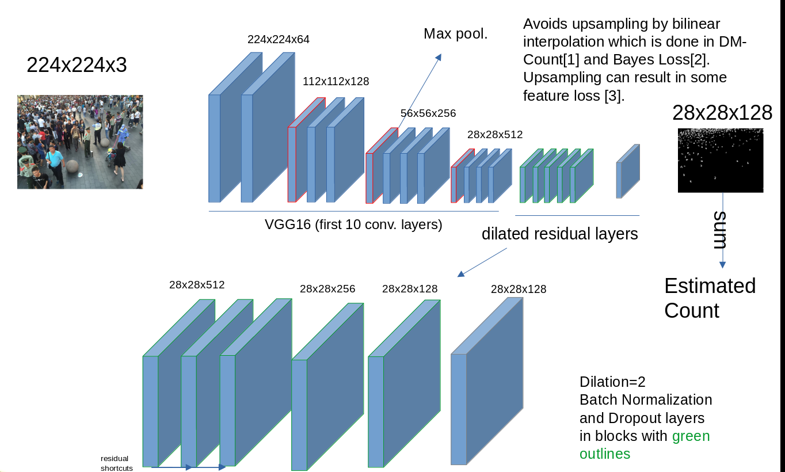

# DMDR-Count

## Dilated variation of [DM-Count](https://github.com/cvlab-stonybrook/DM-Count)
Made a different repo instead of a fork because the two projects grew in different directions.
### Additions to the original repo;
- Arguments are now given by json files.
- There is now TensorBoard integration!
- UCF dataset support!
### For the future;
- Optional command line arguments
- Cleaner checkpoint names
- Documentation about design decisions and usage help.
- Maybe deep learning tutorials?
- Some other approaches I tried but are not ready for publishing.

## The Main Idea


## Repo based on
[Here](https://github.com/cvlab-stonybrook/DM-Count) is the original repo since the interface and the backbone network was different this will not be a fork repo.


Pytorch implementation of the paper [Distribution Matching for Crowd Counting](https://arxiv.org/pdf/2009.13077.pdf) (NeurIPS, spotlight).


## Getting Started
1. Dataset download

+ QNRF can be downloaded [here](https://www.crcv.ucf.edu/data/ucf-qnrf/)

+ NWPU can be downloaded [here](https://www.crowdbenchmark.com/nwpucrowd.html)

+ Shanghai Tech Part A and Part B can be downloaded [here](https://www.kaggle.com/tthien/shanghaitech)

2. Data preprocess

Due to large sizes of images in QNRF and NWPU datasets, we preprocess these two datasets.

```
python preprocess_dataset.py --dataset <dataset name: qnrf or nwpu> --input-dataset-path <original data directory> --output-dataset-path <processed data directory> 
```
    
3. Training
The interface is like this;
```
usage: train.py [-h] [--load-args LOAD_ARGS] [--data-path DATA_PATH] [--dataset {qnrf,nwpu,sha,shb}]
                [--out-path OUT_PATH] [--lr LR] [--weight-decay WEIGHT_DECAY] [--resume RESUME]
                [--auto-resume] [--max-epoch MAX_EPOCH] [--val-epoch VAL_EPOCH] [--val-start VAL_START]
                [--batch-size BATCH_SIZE] [--device DEVICE] [--num-workers NUM_WORKERS] [--wot WOT]
                [--wtv WTV] [--reg REG] [--num-of-iter-in-ot NUM_OF_ITER_IN_OT] [--norm-cood NORM_COOD]

Train

optional arguments:
  -h, --help            show this help message and exit
  --load-args LOAD_ARGS
                        file to read program args from. Will ignore other parameters if specified
  --data-path DATA_PATH
                        dataset path
  --dataset {qnrf,nwpu,sha,shb}
                        dataset name
  --out-path OUT_PATH   place to save checkpoints and models.
  --lr LR               initial learning rate
  --weight-decay WEIGHT_DECAY
                        the weight decay
  --resume RESUME       state dict to resume from. If specified as empty will start over
  --auto-resume         if set will try to find most recent checkpoint in 'out_path'
  --max-epoch MAX_EPOCH
                        max training epoch
  --val-epoch VAL_EPOCH
                        the num of steps to log training information
  --val-start VAL_START
                        the epoch start to val
  --batch-size BATCH_SIZE
                        train batch size
  --device DEVICE       assign device
  --num-workers NUM_WORKERS
                        the num of training process
  --wot WOT             weight on OT loss
  --wtv WTV             weight on TV loss
  --reg REG             entropy regularization in sinkhorn
  --num-of-iter-in-ot NUM_OF_ITER_IN_OT
                        sinkhorn iterations
  --norm-cood NORM_COOD
                        Whether to norm cood when computing distance
```
Training can be done two ways;
```
python train.py --dataset <dataset name: qnrf, sha, shb or nwpu> --data-path <path to dataset> --device <gpu device id>
```  
 or from a desired .json file like args.json in the repository for example;
```
python train.py --load-args args.json
```
When this option is specified other given option from the terminal will be ignored. Some default configurations specific to the selected dataset can be changed from datasets/dataset_cfg.json file.  
To directly run it with default arguments 
make sure you select these correctly;
from args.json file;
```
..
"train":{
  ...
  "dataset":<dataset name>
  ...
  }
..
```
and from datasets/dataset_cfg.json;
```
{
  ..
    ...
    "dataset_paths":{
        "<dataset name>":{
            "data_path":"<dataset root path>", <-- this is important
            other attributes are generally the default
        },
      ...
    }
  ..
}
```


4. Test

The interface is like this;
```
usage: test.py [-h] [--load-args LOAD_ARGS] [--device DEVICE] [--model-path MODEL_PATH]
               [--data-path DATA_PATH] [--dataset {qnrf,nwpu,sha,shb}]
               [--pred-density-map-path PRED_DENSITY_MAP_PATH]

Test

optional arguments:
  -h, --help            show this help message and exit
  --load-args LOAD_ARGS
                        file to read program args from. Will ignore other parameters if specified
  --device DEVICE       assign device
  --model-path MODEL_PATH
                        saved model path
  --data-path DATA_PATH
                        dataset path
  --dataset {qnrf,nwpu,sha,shb}
                        dataset name
  --pred-density-map-path PRED_DENSITY_MAP_PATH
                        save predicted density maps when pred-density-map-path is not empty.
```
```
python test.py --model-path <path of the model to be evaluated> --data-path <directory for the dataset> --dataset <dataset name: qnrf, sha, shb or nwpu>
```
The same applies here you can also use args.json file to load like this;
```
python test.py --load-args args.json
```

## Pretrained models

Pretrained models on UCF-QNRF, NWPU, Shanghaitech part A and B can be found in pretrained_models folder or [Google Drive](https://drive.google.com/drive/folders/10U7F4iW_aPICM5-qJq21SXLLkzlum9tX?usp=sharing)

## References
If you find this work or code useful, please cite:

```
@inproceedings{wang2020DMCount,
  title={Distribution Matching for Crowd Counting},
  author={Boyu Wang and Huidong Liu and Dimitris Samaras and Minh Hoai},
  booktitle={Advances in Neural Information Processing Systems},
  year={2020},
}
```
